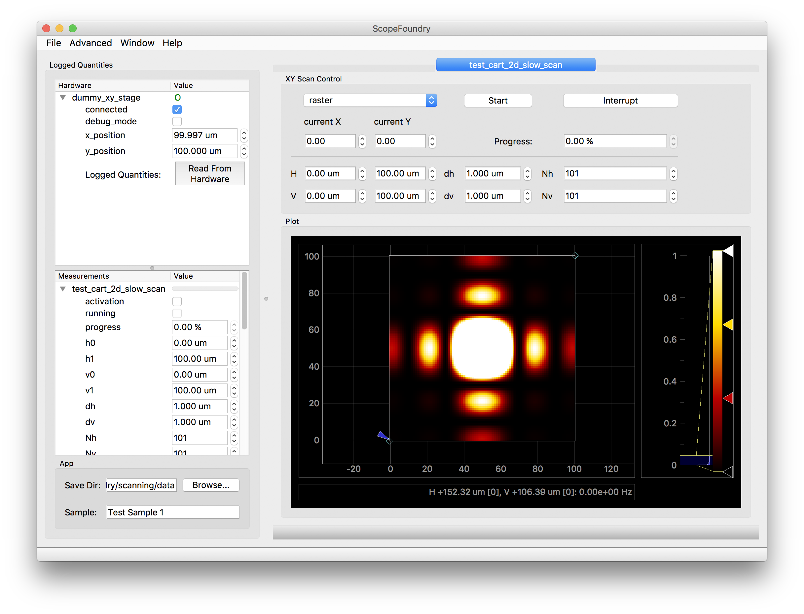

Building Your First Microscope
==============================


Step 1: Installing Python and ScopeFoundry
------------------------------------------

[anaconda_dl]: (https://www.continuum.io/downloads)

Note: We recommend the [Anaconda][anaconda_dl] python distribution, which contains many easy to install scientific python packages.


* Download and Install [Anaconda][anaconda_dl]. Recommended python version is 3.5, but 2.7 will also work.

* Create an [conda environment](http://conda.pydata.org/docs/using/envs.html) includes ScopeFoundry and its dependencies. Open an Anaconda prompt and run the following commands:

```sh
$ conda create -n scopefoundry python=3.5
$ source activate scopefoundry
(scopefoundry) $ conda install numpy pyqt qtpy h5py
(scopefoundry) $ pip install pyqtgraph
(scopefoundry) $ pip install git+git://github.com/ScopeFoundry/ScopeFoundry.git
```	

Note: On Windows `source activate scopefoundry` should be replaced by `activate scopefoundry`

Step 2: Create your Microscope App
----------------------------------


Make a directory of for you microscope, say `fancy_microscope`, and create a file inside called `fancy_microscope.py` with the following content

```python
# handy python 2/3 compatiblity
from __future__ import division, print_function, absolute_import

# import the base class from ScopeFoundry that you 
# will subclass for your for your microscope
from ScopeFoundry import BaseMicroscopeApp


class FancyMicroscopeApp(BaseMicroscopeApp):

    # this is the name of the microscope that ScopeFoundry uses 
    # when storing data
    name = 'fancy_microscope'
    
    # You must define a setup function that adds all the 
    #capaiblities of the microscope and sets default settings
    def setup(self):
        
        #Add App wide settings
        
        #Add hardware components
        print("Adding Hardware Components")

        #Add measurement components
        print("Create Measurement objects")

        # Connect to custom gui
        
        # load side panel UI
        
        # show ui
        self.ui.show()
        self.ui.activateWindow()
        
        #self.settings_load_ini("fancy_settings.ini")


if __name__ == '__main__':
    import sys
    
    app = FancyMicroscopeApp(sys.argv)
    sys.exit(app.exec_())
```

Step 3: Install hardware and measurement plug-ins
-------------------------------------------------

We will use a simple 'hardware' plug-in that presents the python random number generator as a piece of hardware to ScopeFoundry.

Install plug-in from github source:
```
(scopefoundry) $ pip install git+git://github.com/ScopeFoundry/HW_random_gen.git
```

Add the hardware plug-in to your microscope app by adding these lines to `setup()`:

```python
def setup(self):
	...
	from ScopeFoundryHW.random_gen import RandomNumberGenHW
 	self.add_hardware_component(RandomNumberGenHW(self))
 	...
```

This hardware plug-in also includes a measurement object to plot and save data based on the output of the hardware object. Let's include it in the the microscope app via `setup()`:

```python
def setup(self):
	...
	from ScopeFoundryHW.random_gen import RandomNumberGenOptimizerMeasure
 	self.add_measurement_component(RandomNumberGenOptimizerMeasure(self))
 	...
```


Step 4: Run your App
---------------------------


Run your app:

```
python fancy_microscope_app.py
```




In this graphical interface we do the following

* Connect to hardware (here our dummy `random_gen` plug-in)
* Setup measurement conditions (How often we sample the data)
* Run measurement and plot the data flowing in


Step 5: Analyze Data
--------------------
[HDFView]: https://support.hdfgroup.org/products/java/hdfview/
[HDF Group]: https://www.hdfgroup.org/
[h5py]: http://www.h5py.org

The measurement will auto-save a data-file that contains the optimizer history to an HDF5 (.h5) data file within the specified Save Directory. This data file contains the data along with data structures that include all the meta-data from the microscope App. To view this data file, we can use a graphical viewer [HDFView] provided by the [HDF Group].

{ Show H5 Hierarchy}

We can access this data file in Python using the [h5py] package.

```python
import h5py

dat = h5py.File('123123123_rand_gen_optimizer.h5', 'r')

sample_name = dat['app'].attrs['sample']
print(sample_name)

optimizer_data = dat['measurements/rand_gen_optimizer/optimizer_history']

import matplotlib.pyplot as plt
plt.plot( optimizer_data)

```


## Next Steps

See these tutorials for a more detailed look into how to customize your microscope with ScopeFoundry: 

* ScopeFoundry [Key Concepts](key_concepts.md)
* Build a custom Measurement
* Build a custom [Hardware plugin](building_a_custom_hardware_plugin.md)
* Build a custom [Data Browser View]((./databrowser_view_tutorial.md)) for your data files
* Create a custom side bar


## Where to Find Out More

This tutorial code is available in the [HW\_random\_gen](https://github.com/scopefoundry/HW_random_gen/) repository.

For questions about this tutorial or ScopeFoundry in general, please visit and post on the ScopeFoundry [project mailing list and forum](https://groups.google.com/forum/#!forum/scopefoundry).

For source code of all ScopeFoundry projects visit our [GitHub page](https://github.com/scopefoundry/).


