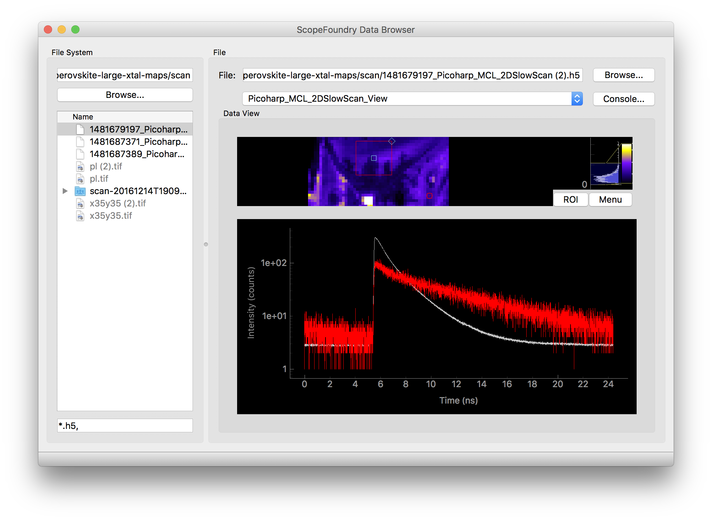

DataBrowser View Plug-in Tutorial
=================================

ScopeFoundry provides a DataBrowserApp that makes it easy for a user to explore a set of experiemental results on their computer. It is a plug-in based application, where data-type plug-ins, ie a `View`, can show relevant information about the data file. The [FoundryDataBrowser](https://github.com/ScopeFoundry/FoundryDataBrowser) project is an example of the ScopeFoundry DataBrowser with a number of Views used to browse experiemental data the Molecular Foundry.




Lets define a custom view. We do this by subclassing the DataBrowserView class. Three methods should be defined `setup()`, `is_file_supported`, and `on_change_data_filename`.

Here is an example of a simple dataviewer that uses a PyQtGraph ImageView to display an image loaded via scipy:

```python
from ScopeFoundry.data_browser import DataBrowserView
import pyqtgraph as pg
import numpy as np
from scipy.misc import imread
import os

#scipy imread uses the Python Imaging Library (PIL) to read an image

class ScipyImreadView(DataBrowserView):

    name = 'scipy_imread_view'
    
    def setup(self):
        # create the GUI and viewer settings, runs once at program start up
        # self.ui should be a QWidget of some sort, here we use a pyqtgraph ImageView
        self.ui = self.imview = pg.ImageView()

    def is_file_supported(self, fname):
    	 # Tells the DataBrowser whether this plug-in would likely be able
    	 # to read the given file name
    	 # here we are using the 
        _, ext = os.path.splitext(fname)
        return ext.lower() in ['.png', '.tif', '.tiff', '.jpg']

        
    def on_change_data_filename(self, fname):
        #  A new file has been selected by the user, load and display it
        try:
            self.data = imread(fname)
            self.imview.setImage(self.data.swapaxes(0,1))
        except Exception as err:
        	  # When a failure to load occurs, zero out image
        	  # and show error message
            self.imview.setImage(np.zeros((10,10)))
            self.databrowser.ui.statusbar.showMessage(
            	"failed to load %s:\n%s" %(fname, err))
            raise(err)
```

To use this view you can create a DataBrowser script like this:

```python
from ScopeFoundry.data_browser import DataBrowser

app = DataBrowser(sys.argv)

# views are loaded in order of more generic to more specific.
## ie the last loaded views are checked first for compatibility

from viewers.images import ScipyImreadView
app.load_view(ScipyImreadView(app))
    
# More views here

sys.exit(app.exec_())
```

Here is a resulting screen shot of running this data browser script and navigating to a folder with TIFF images.


