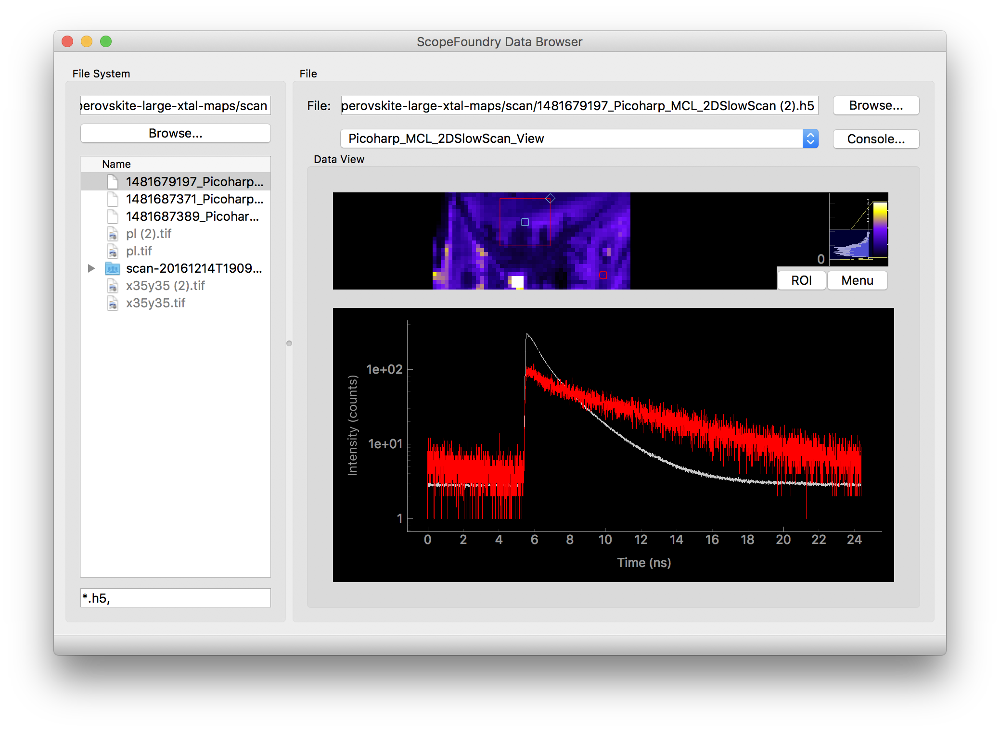

# ScopeFoundry

A Python platform for controlling custom laboratory experiments and visualizing scientific data

GitHub page: <https://github.com/ScopeFoundry/>

## Why ScopeFoundry?

An open-source alternative to LabView or MATLAB instrument control.

* Modular, multi-threaded Python graphical interface allows for fast data acquisition and visualization 
* Build lab equipment graphical interfaces grapically with QT
* Live updates of measurement code for fast development and debugging
* Hardware plug-ins for simple and complex scientific equipment

Uses: 

* Currently used in multi-modal scanning microscopy measurements with electrons and optics
* Flexible for many other data acquisition tasks

## Documentation

* [Key Concepts](key_concepts.md)
* [Advanced Development](advanced_dev.md)

## Tutorials

### [Build Your First Microscope](./building_your_first_microscope.md)

### [Build a Hardware Plug-in](./building_a_custom_hardware_plugin.md)

### [Build a Data Browser Viewer][databrowser_link]
[][databrowser_link]

[databrowser_link]: ./databrowser_view_tutorial.md

